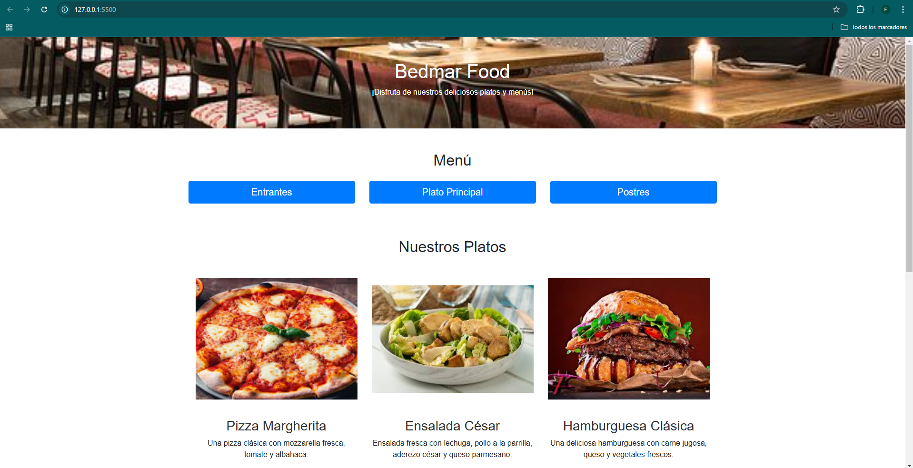

# Bedmar Food

¡Bienvenido a **Bedmar Food**, un proyecto web diseñado para mostrar un sitio de menú de restaurante, completo con páginas dedicadas para entrantes, platos principales, postres y una sección de contacto!

## Descripción del proyecto
Este proyecto es una página web sencilla y visualmente atractiva, construida con HTML5, CSS3 y el framework de Bootstrap. El objetivo principal es presentar información sobre un restaurante imaginario llamado **Bedmar Food**, que incluye:

- Un encabezado introductorio.
- Un menú con enlaces a otras páginas.
- Una galería de platos destacados con descripciones.
- Un formulario de contacto funcional.
- Diseño responsivo para adaptarse a diferentes dispositivos.

## Tecnologías utilizadas
- **HTML5:** Para la estructura del contenido.
- **CSS3:** Para estilos personalizados.
- **Bootstrap:** Para un diseño responsivo y componentes estilizados.
- **JavaScript:** (Futuro, opcional) Para agregar interactividad adicional.

## Estructura de archivos
El proyecto tiene la siguiente estructura de directorios:

```
BedmarFood/
|-- index.html           # Archivo principal del proyecto
|-- styles.css           # Archivo CSS personalizado
|-- /img                 # Carpeta con imágenes de los platos
|-- /entrantes.html      # Página dedicada a los entrantes
|-- /principal.html      # Página dedicada a los platos principales
|-- /postres.html        # Página dedicada a los postres
```

## Características
1. **Encabezado atractivo:** Un título y descripción que resumen la temática del restaurante.
2. **Navegación intuitiva:** Enlaces que permiten explorar las diferentes categorías del menú.
3. **Galería de platos:** Una selección de platos con imágenes y descripciones.
4. **Formulario de contacto:** Permite a los usuarios enviar mensajes.
5. **Diseño responsivo:** La página se adapta a móviles, tabletas y escritorios.

## Configuración y uso
1. Clona este repositorio en tu máquina local:
   ```bash
   git clone https://github.com/tu-usuario/bedmar-food.git
   ```
2. Navega al directorio del proyecto:
   ```bash
   cd bedmar-food
   ```
3. Abre el archivo `index.html` en tu navegador preferido.

## Capturas de pantalla
### Página Principal


### Galería de Platos


### Formulario de Contacto


## Contribución
Si deseas contribuir:
1. Haz un fork del repositorio.
2. Crea una rama para tu funcionalidad o corrección de errores:
   ```bash
   git checkout -b mi-rama
   ```
3. Realiza tus cambios y haz commit:
   ```bash
   git commit -m "Agregada nueva funcionalidad"
   ```
4. Sube tus cambios:
   ```bash
   git push origin mi-rama
   ```
5. Abre un Pull Request.

## Licencia
Este proyecto está bajo la Licencia MIT. Consulta el archivo `LICENSE` para más información.

---

¡Gracias por visitar **Bedmar Food**! Si tienes alguna pregunta o sugerencia, no dudes en contactarnos.

